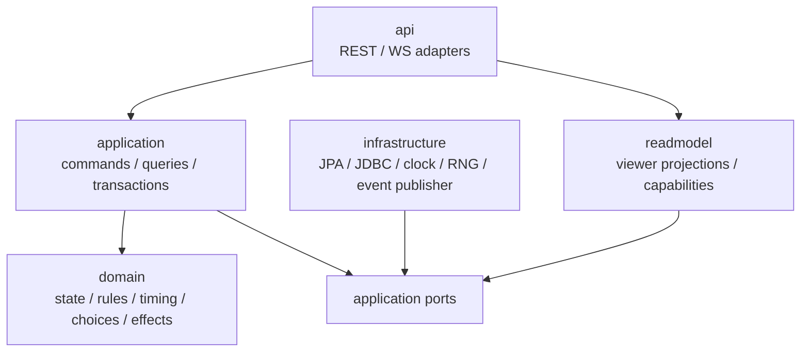

# 目標模組架構

更新日期：2026-09-03
定位：後端 modular monolith 邊界與依賴規則

> 本文件描述目標邊界；遷移時必須遵守 recovery baseline 與 legacy facade budget，不做全量 package move。

## 一、目標形態



domain 不依賴 Spring MVC、JPA entity、`JdbcTemplate` 或 WebSocket。遷移期允許 application handler 呼叫 legacy adapter，但要明確標示方向。

## 二、bounded contexts

| 模組 | 責任 | 不應知道 |
| --- | --- | --- |
| `identity` | LINE/JWT、current user | 卡牌與對戰規則 |
| `catalog` | 卡片、變體、效果 plan、資料版本 | 玩家對戰狀態 |
| `deck` | 牌組編輯、格式與合法性 | 對戰 mutation |
| `lobby` | 房間、加入、ready、配對、啟動 | action/effect 細節 |
| `match` | 對戰 command、rules、state、projection、realtime | admin UI 與牌組編輯 |
| `customization` | 共用背景素材 | 對戰規則 |
| `shared` | 極少量技術共用型別 | feature-specific service |

`shared` 不是雜物箱。只有跨兩個以上模組且不帶 feature 語意的型別才可進入。

## 三、match 模組內部

建議最終 package：

```text
com.hololive.cardgame.match
├── api
│   ├── rest
│   ├── websocket
│   └── dto
├── application
│   ├── command
│   ├── query
│   ├── port
│   └── service
├── domain
│   ├── model
│   ├── rule
│   ├── timing
│   ├── choice
│   ├── effect
│   └── event
├── infrastructure
│   ├── persistence
│   ├── random
│   ├── clock
│   └── realtime
└── readmodel
    ├── projection
    └── capability
```

不要先做全量 package move。先在現有 package 建立介面與新類別，當一個 vertical slice 完成且依賴只向內時，再搬該 slice。

## 四、application command boundary

統一流程：

```text
Controller
  -> MatchCommandGateway.submit(commandEnvelope)
  -> transaction + match lock
  -> expectedVersion / membership / pending checks
  -> ActionHandler
  -> RuleEvaluator
  -> mutation/effect/timing orchestration
  -> append accepted command + events
  -> bump stateVersion
  -> commit
  -> after-commit publish
```

核心型別建議：

```java
public record MatchCommandEnvelope(
    UUID commandId,
    long matchId,
    long actorUserId,
    long expectedStateVersion,
    MatchCommand command
) {}

public sealed interface MatchCommand
    permits DrawTurnCommand, PlayCardCommand, BloomCommand, AttackCommand, ResolveChoiceCommand {}

public record MatchCommandResult(
    UUID commandId,
    long previousStateVersion,
    long stateVersion,
    CommandStatus status,
    List<GameEvent> events
) {}
```

遷移期 command handler 可以委派現有 `MatchActionService` public method，但 controller 不再各自複製 try/catch、publish 與 NPC follow-up。

## 五、domain 邊界

### State

`MatchState` 是 rule evaluator 所需的 domain snapshot，不必一開始做完整 aggregate ORM。可以由 query port 從既有 tables 組裝。

至少包含：

- match/ruleset/card-data/state version。
- current player、turn、phase。
- 各玩家 public/private zones。
- stage holomem、stack、attached cheer/support、damage/status。
- turn-scoped effects 與 usage。
- pending choice 與 timing queue。
- deterministic RNG cursor。

### Rules

規則分三類：

- `CommandRule`：此 command 在目前 state 是否可接受。
- `TargetRule`：合法 target/candidate。
- `Invariant`：任何 mutation 後都必須成立。

rule 回傳結構化 code，不回傳 UI 文案：

```java
RuleResult.denied(GameRuleCode.NOT_YOUR_TURN, Map.of("currentPlayerId", ...));
```

### Effects

effect plan 是 typed data，handler 只產生 mutation/event，不直接建立前端 modal。需要玩家輸入時產生 `PendingChoice` continuation。

### Timing

同時觸發效果先進 timing queue，依規則排序後逐項處理。不要讓各 action service 自己以不同順序呼叫 Gift/Bloom/Down follow-up。

## 六、ports 與 adapters

初期必要 ports：

| Port | 用途 | 現有 adapter |
| --- | --- | --- |
| `MatchStateLoadPort` | 鎖定並讀取 domain snapshot | repository + JDBC |
| `MatchMutationPort` | 套用已驗證 mutation | `GameActionExecutor` / legacy service |
| `MatchEventAppendPort` | 寫 accepted command/event | `match_actions` |
| `PendingChoicePort` | 讀寫 choice continuation | pending decision table |
| `CardDefinitionPort` | 讀取已版本化 card plan | card tables |
| `MatchProjectionPort` | 產生 viewer state | `MatchGameStateService` |
| `MatchEventPublishPort` | commit 後通知連線 | `MatchSocketHandler` |
| `RandomSourcePort` | deterministic dice/shuffle | 新 seed/cursor adapter |

禁止 domain service 直接依賴 `JdbcTemplate`。遷移期若無法一次抽離，將 SQL 放入命名清楚的 infrastructure adapter。

## 七、目前類別的遷移對映

| 現有類別 | 目標角色 |
| --- | --- |
| `MatchController` | thin REST adapter |
| `MatchActionService` | compatibility facade，逐步由 handlers 取代 |
| `MatchEffectService` | legacy effect adapter，逐步由 primitive registry 取代 |
| `MatchTurnLifecycleService` | application/domain timing 協調器，需拆 persistence |
| `MatchDecisionResolutionService` | `ResolveChoiceHandler` 的遷移來源 |
| `GameActionExecutor` | infrastructure `MatchMutationPort` adapter |
| `EffectResolver` | primitive compiler/registry 的第一批來源 |
| `MatchGameStateService` | viewer projection adapter |
| `MatchSocketHandler` | realtime adapter |
| `HardNpcService` | legal-action policy + command client |
| action validator/resolver/application pilots | vertical slice 模板，統一命名後移入 command package |

## 八、依賴防守

新模組至少遵守：

- `domain` 不 import `controller`、`dto`、`entity`、`repository`、Spring JDBC/JPA/WebSocket。
- `application` 可依賴 domain 與 port，不依賴 controller。
- `infrastructure` 實作 port，可依賴 Spring 與 persistence。
- `api` 只做 authentication、DTO mapping、HTTP status。
- `catalog/deck/lobby` 不直接 import `match.service.*`。

完成第一個 vertical slice 後加入 architecture test。可使用 ArchUnit，但應作為 test dependency，且先以 3 至 5 條高價值規則起步。

## 九、搬移原則

1. 先建立邊界，後搬程式碼。
2. 先讓舊 facade 委派新 handler，確認測試，再刪 dead helper。
3. 一次只搬一個 action family 或一個 effect family。
4. 純搬移與規則修正分開 commit。
5. 不把 `Map<String, Object>` 原封不動包進新的「domain」類別；邊界處應轉成 typed record。
6. package move 不與 DB migration、API breaking change 同批。
