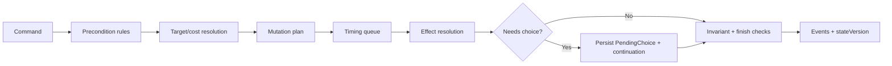

# 卡牌對戰引擎藍圖

原始日期：2026-07-24
重新審閱：2026-09-03
定位：讓架構符合回合制卡牌遊戲的 domain blueprint

> 本藍圖仍作為長期方向，但 EffectPrimitive、timing queue 與 deterministic RNG 已排到 R4；不得跳過 BE-002、BE-007、BE-003、BE-005 的前置能力。

## 一、設計目標

卡牌引擎必須優先保證：

- 伺服器權威。
- 相同輸入可重現。
- 時機與觸發順序可說明。
- 隱藏資訊不外洩。
- 玩家選擇可暫停並可靠續接。
- 卡片勘誤、規則版本與舊對戰可共存。
- NPC、真人玩家與測試走同一 command pipeline。

## 二、command pipeline

每個玩家操作都經過相同階段：



每一階段要有 typed input/output。失敗不得留下部分 mutation；需要玩家選擇時，已完成的 deterministic 部分與 continuation 必須在同一交易保存。

## 三、伺服器權威合法操作

`ActionCapabilities` 是 viewer-specific read model，不是另一套執行器。

建議結構：

```json
{
  "stateVersion": 42,
  "actions": [
    {
      "type": "BLOOM",
      "enabled": true,
      "sourceIds": [101, 102],
      "targetsBySource": { "101": [501] }
    },
    {
      "type": "ATTACK_ART",
      "enabled": false,
      "reasonCode": "PHASE_NOT_ALLOWED"
    }
  ]
}
```

要求：

- capability 與 command handler 共用 rule/target evaluator。
- capability 可少算昂貴預覽，但不能允許 handler 一定拒絕的操作。
- client 不從 `recentActions` 猜 draw/cheer 是否完成。
- NPC 只從 capabilities 選 action，再提交 command。

## 四、PendingChoice continuation

目前 `pendingDecisions` 與 `pendingInteractions` 來自相近 persistence model，但 API 分成兩套。domain 應收斂為：

```java
public record PendingChoice(
    UUID choiceId,
    long matchId,
    long ownerUserId,
    ChoiceKind kind,
    ChoiceConstraints constraints,
    List<ChoiceCandidate> candidates,
    Continuation continuation,
    long createdAtStateVersion
) {}
```

`Continuation` 不保存可執行程式碼，而保存可驗證的 typed plan：

- `resumePoint`
- `sourceCommandId`
- `sourceCardInstanceId`
- `remainingEffectSteps`
- `timingQueue`
- 必要的 snapshot references

規則：

- 有 blocking choice 時，只允許 `RESOLVE_CHOICE`、`CONCEDE` 與明確標記的系統 command。
- resolve 必須驗證 owner、stateVersion、候選、min/max、順序與 choice 尚未完成。
- 重複 resolve 使用相同 commandId 回傳相同結果。
- UI title/message 是 projection 責任，不寫入 domain decision。

## 五、時機與觸發佇列

建議標準化 timing：

- `TURN_START`
- `DRAW_COMPLETED`
- `CHEER_ASSIGNED`
- `MAIN_ACTION_COMPLETED`
- `CARD_ENTERED_STAGE`
- `BLOOM_COMPLETED`
- `COLLAB_COMPLETED`
- `ART_DECLARED`
- `BEFORE_DAMAGE`
- `AFTER_DAMAGE`
- `HOLOMEM_DOWNED`
- `LIFE_LOST`
- `TURN_END`
- `MATCH_FINISH_CHECK`

每個 `TriggeredEffect` 至少包含：

- timing。
- controller/owner。
- source card instance。
- priority/order。
- once-per-turn usage key。
- condition plan。
- effect plan。

排序規則應集中於 `TimingQueuePolicy`。任何卡號特例若真的無法資料化，也要實作為命名清楚的 `SpecialRule` 並註冊，不可散落在 action service。

## 六、EffectPrimitive

### 原則

- primitive 描述「要做什麼」。
- handler 描述「如何合法執行」。
- condition/target/value 使用 typed expression。
- composite effect 由 sequence、branch、repeat、choice 組成。

第一階段建議穩定的 primitive：

- `DRAW`
- `MOVE_CARD`
- `MOVE_HOLOMEM`
- `DEAL_DAMAGE`
- `HEAL`
- `REDUCE_LIFE`
- `ATTACH_CHEER`
- `REMOVE_CHEER`
- `ADD_TURN_MODIFIER`
- `APPLY_STATUS`
- `ROLL_DICE`
- `SEARCH_CARDS`
- `REVEAL_CARDS`
- `CREATE_CHOICE`
- `FINISH_MATCH`

不要把 `BLOOM`、`ATTACK_ART` 等玩家 action 當成單一 primitive；它們是 application command，內含多個 rule/effect/timing 步驟。

### 編譯流程

```text
Official text / import data
  -> parser/compiler
  -> typed EffectPlan(version)
  -> schema validation + coverage report
  -> published CardDefinition(version)
  -> match snapshot pins version
  -> runtime handler registry
```

runtime 不再重新猜測效果文字。legacy 路徑必須輸出：

- `legacyEffectUsed` metric。
- card/effect identifier。
- unsupported reason。
- 執行 summary。

## 七、確定性亂數

每場對戰建立：

- `rngSeed`
- `rngAlgorithmVersion`
- `rngCursor`

所有 shuffle、dice、隨機 target 都透過 `RandomSourcePort`。每次消耗要記錄 event，至少包含 cursor 與結果。禁止在對戰規則直接呼叫：

- `Math.random`
- `ThreadLocalRandom`
- 未注入 seed 的 `Random`

測試可固定 seed；回放以相同 algorithm version 重現。若未來更換算法，舊 match 仍使用原版本。

## 八、規則與卡片資料版本

match start snapshot 至少固定：

- `rulesetVersion`
- `cardDataVersion`
- deck card IDs/counts
- card definition revision 或可解析到 revision 的 catalog version
- banned/restricted list version

進行中的 match 不因管理員更新卡片或匯入新版資料而改變效果。

## 九、狀態不變量

每次 accepted command 後檢查高價值 invariants：

- 一個 card instance 只存在一個 zone/stack。
- card owner 在 match 期間不被意外改變。
- 每位玩家至多一個 CENTER 與一個 COLLAB。
- BACK 不超過規則上限。
- attached card 的 holder 必須存在且可附著。
- current player 必須是 match player。
- phase transition 合法且 turn number 單調遞增。
- blocking choice 至多一個 active resolver owner，或有明確 queue order。
- life、damage、cost 與 count 不落入非法範圍。
- finished match 不再接受一般 command。
- hidden zone 不出現在未授權 projection。

production 可只執行低成本 invariants；完整 invariants 放在 test/replay harness。

## 十、NPC 與未來 AI

目標介面：

```text
ActionCapabilities
  -> NpcPolicy.choose(capabilities, viewerState)
  -> MatchCommand
  -> MatchCommandGateway
```

NPC policy 不自行修改 DB、不直接呼叫 action-specific service、不複製 phase 規則。如此未來可替換：

- rule-based easy/hard policy。
- heuristic search。
- Monte Carlo。
- 遠端 AI。

引擎仍只接受同一 command，安全邊界不因 NPC 類型改變。

## 十一、完成準則

- 新 primitive 有 schema、handler、unit test、integration scenario 與 coverage mapping。
- 新 trigger timing 只在 timing registry/policy 新增，不散落呼叫。
- 任何 random path 可由 seed 重現。
- resolve choice 可在服務重啟後續接。
- capability、command validation 與 NPC 不存在三套規則。
- 新卡預設不新增 `apply<CardId>...` 方法。
