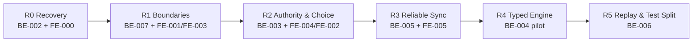

# 最新系統優化計畫入口

更新日期：2026-09-03
狀態：ACTIVE
適用 repository：`hololive-cardgame-backend` 與相鄰的 `hololive-cardgame-frontend`

前端配套計畫：[前端系統優化計畫入口](../../../../hololive-cardgame-frontend/doc/系統優化/README.md)

## 一、這次重新基準化的目的

本計畫取代 2026-07-24 文件中的舊優先序，但保留仍成立的架構決策。重新基準化依據是目前工作樹、GitNexus、檔案責任、測試結果與前端 lint/build 現況，不假設兩個月前標記的工作包仍然完成或可直接開始。

核心策略是「可恢復的 vertical slice strangler」：

- 先恢復乾淨、可提交、可驗證的基線。
- 以 command/action family 搬移 ownership，不再持續抽零散 helper。
- legacy facade 設成不再成長的相容層。
- rule、capability、NPC 與 UI 使用同一份伺服器權威事實。
- 高風險的 realtime、effect、timing、replay 依前置能力逐步導入。

## 二、目前基準事實

### 後端

- `MatchActionService.java`：約 5,003 行、約 157 個 methods、75 個依賴欄位。
- `MatchEffectService.java`：約 4,910 行、約 140 個 methods、48 個依賴欄位。
- `service/`：約 311 個 Java 檔。
- `MatchActionServiceIntegrationTest.java`：約 32,302 行。
- BE-001、BE-002 已 commit；BE-002 以 9 個 unit、8 個 focused integration、compile 與 diff check 完成驗收。
- GitNexus 對 BE-002 識別出 41 個 changed symbols、20 條受影響流程，風險為 CRITICAL；主因是共用 rule 與 game-state projection 橫跨多條 action flow，已由 pilot parity/contract tests 鎖定。

### 前端

- `App.tsx`：約 1,235 行。
- `GameRoomScreen.tsx`：約 1,942 行。
- `services/api.ts`：約 622 行。
- `App.css`：約 1,626 行。
- FE-000 已完成：build 與 lint 通過（0 errors、0 warnings），Vitest 5 tests 通過。
- 已有 pure selector/test baseline；component/E2E recovery net 於後續 FE-003～FE-005 逐步補齊。
- STARTED match 同時使用 WebSocket full snapshot 與每 1.5 秒兩個 GET 的常態 polling。

## 三、相較舊計畫的調整

| 舊作法 | 新作法 |
| --- | --- |
| 持續依 helper/service extraction 降低行數 | 以 command vertical slice 搬移 ownership，並要求舊依賴實際下降 |
| BE-002 文件先標 DONE | 以測試、parity、commit 與 detect-changes 全部完成後才標 DONE |
| FE-001 同時承擔架構與品質基線 | 新增 FE-000，先把 lint/build/test baseline 建起來 |
| BE-003/BE-005 在 BE-001 後直接競爭優先序 | 先用 BE-007 擴大已建立的 command seam，降低 MatchAction 風險 |
| 每個 extraction 建 acceptance review | 只更新 live status 與 work item，commit/test output 作證據 |
| 測試巨檔最後一次拆 | 先抽 scenario fixture，之後每個 vertical slice 順手搬對應測試 |

## 四、最新執行順序

同一工作樹一次只做一份 work item。若使用不同 worktree，也不得同時修改 `MatchActionService` 的同一責任區。

## 五、工作包狀態

### 後端

| ID | 狀態 | 目的 |
| --- | --- | --- |
| [BE-001](work-items/BE-001-建立MatchCommandGateway.md) | DONE | 建立 command gateway pilot |
| [BE-002](work-items/BE-002-建立ActionCapabilities.md) | DONE | 四個回合操作的 server-authoritative capabilities |
| [BE-007](work-items/BE-007-遷移回合CommandVerticalSlices.md) | IN_PROGRESS | DRAW_TURN 已完成；下一條為 SEND_TURN_CHEER |
| [BE-003](work-items/BE-003-統一PendingChoice.md) | READY_AFTER_BE-007 | 收斂 decision/interaction 為 PendingChoice |
| [BE-005](work-items/BE-005-導入狀態版本與冪等.md) | READY_AFTER_BE-003 | state version、command idempotency、gap detection |
| [BE-004](work-items/BE-004-建立EffectPrimitive管線.md) | BLOCKED_BY_BE-003_BE-005 | typed effect/timing pilot |
| [BE-006](work-items/BE-006-建立ReplayHarness並拆測試巨檔.md) | BLOCKED_BY_BE-004_BE-005 | replay harness 與測試巨檔治理 |

### 前端

| ID | 狀態 | 目的 |
| --- | --- | --- |
| FE-000 | DONE | 建立 lint/build/test 綠色基線 |
| FE-001 | READY | 拆 API contracts 與 feature clients |
| FE-003 | BLOCKED_BY_FE-001 | GameRoom selectors、ChoiceHost、metadata seam |
| FE-004 | BLOCKED_BY_FE-003 | 改由 ActionCapabilities 驅動畫面 |
| FE-002 | BLOCKED_BY_FE-001 | 抽 auth/lobby session，縮小 App |
| FE-005 | BLOCKED_BY_BE-005_FE-002 | versioned realtime 與 polling fallback |

詳細依賴、風險與 checkpoint 見 [05-遷移路線與工作包索引.md](05-遷移路線與工作包索引.md)。

## 六、文件閱讀方式

### 恢復工作

1. 本 README。
2. [05-遷移路線與工作包索引.md](05-遷移路線與工作包索引.md)。
3. 當前 work item。
4. repository `AGENTS.md`。

### 架構決策

1. [00-架構現況與決策.md](00-架構現況與決策.md)
2. [01-目標模組架構.md](01-目標模組架構.md)
3. [02-卡牌對戰引擎藍圖.md](02-卡牌對戰引擎藍圖.md)
4. [03-同步回放與觀測藍圖.md](03-同步回放與觀測藍圖.md)
5. [04-測試策略與品質閘門.md](04-測試策略與品質閘門.md)

藍圖文件描述目標，不代表允許跳過目前 work item 的前置條件。

## 七、每批固定規約

1. 先確認 git status，保留使用者未提交變更。
2. 修改 code symbol 前執行 GitNexus upstream impact。
3. 先補 characterization/contract，再搬 ownership。
4. 一批只做一個 vertical slice，不混合格式化、規則修正、package move 與 DB/API breaking change。
5. 新增新服務時，必須說明它移除了哪一段舊責任；只增加委派層不算完成。
6. 公開 DTO、DB schema、timing、hidden projection 變更需先說明相容與回滾。
7. 完成後執行 work item 的測試、GitNexus detect changes 與 `git diff --check`。
8. 只更新 work item 與本計畫狀態，不建立新的 acceptance 流水帳。
9. 前後端分開 commit，commit 訊息使用繁體中文。

## 八、整體完成定義

- `MatchActionService`、`MatchEffectService` 不再是新增功能的預設落點，且依賴數持續下降。
- command validation、capability、NPC 與 UI 不再各自複製規則。
- pending choice 有統一 continuation model。
- duplicate/stale command 可安全處理，WebSocket gap 可恢復。
- 新 effect 優先走 versioned typed plan，legacy fallback 可量測。
- 相同 seed、ruleset、snapshot 與 command sequence 可重現 state hash。
- 前端 lint/build/test 維持綠色，正常 socket 下不常態 polling。
